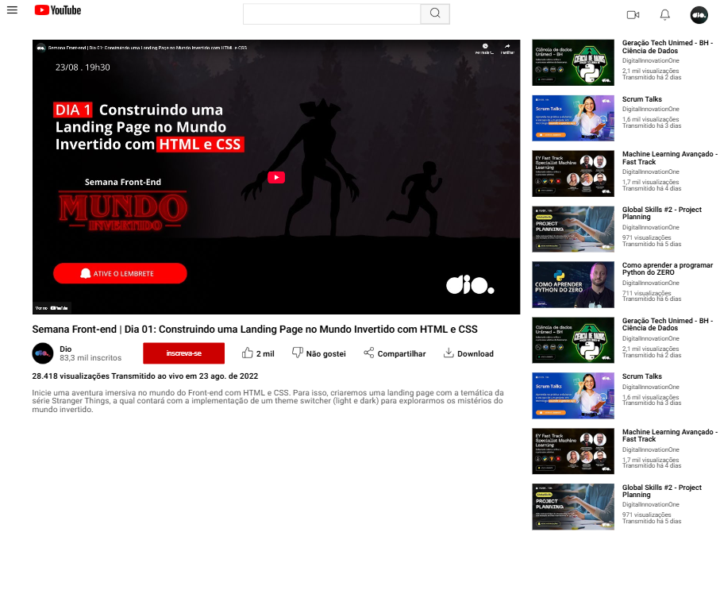

# 🚀 Desafio 02: Criando uma Landing Page clone do YouTube

Este projeto faz parte da **Trilha de CSS** promovida pela [DIO (Digital Innovation One)](https://www.dio.me/), durante o bootcamp **Front-End**, com parceria do **Santander**.

## 🎯 Desafio

O objetivo foi construir uma landing page estilizada como o YouTube, utilizando **HTML** e **CSS** puro. Este desafio foi pensado para reforçar os conceitos aprendidos ao longo da trilha, com foco especial no uso de **Flexbox**.

## 📌 O que foi utilizado

- **HTML5**: Estrutura semântica da página;
- **CSS3**: Estilização completa com:
  - Flexbox para alinhamento e distribuição dos elementos;
  - Unidades relativas e absolutas (%, `rem`, `vh`, `px`);
  - Cores e fontes inspiradas na identidade visual do YouTube;
- **Figma**: Para referência de layout e espaçamento.  
  👉 [Clique aqui para acessar o projeto no Figma](https://www.figma.com/design/lrRWUZPKnqMDZrSDJmZxUS/Desafio-de-Flexbox---DIO?node-id=0-1)

## 🧩 Layout atual

O projeto foi desenvolvido inicialmente para telas com resolução **1440x1024**, como proposto no Figma.

## 📱 Próximos passos

- [ ] Adicionar **responsividade**: adaptar o layout para dispositivos móveis e tablets;
- [ ] Adicionar interações com **JavaScript** (futuramente).

##
> by Abgail Diniz
