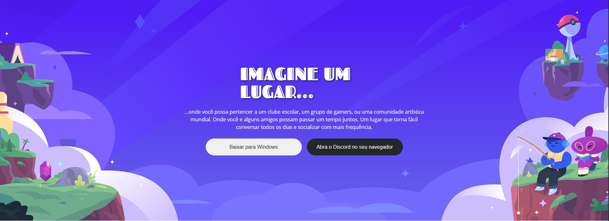
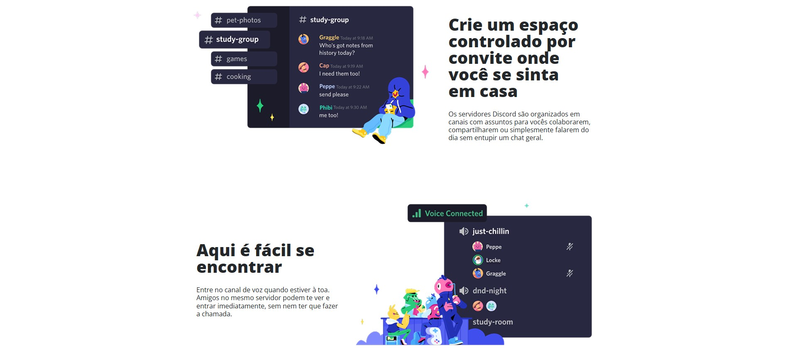
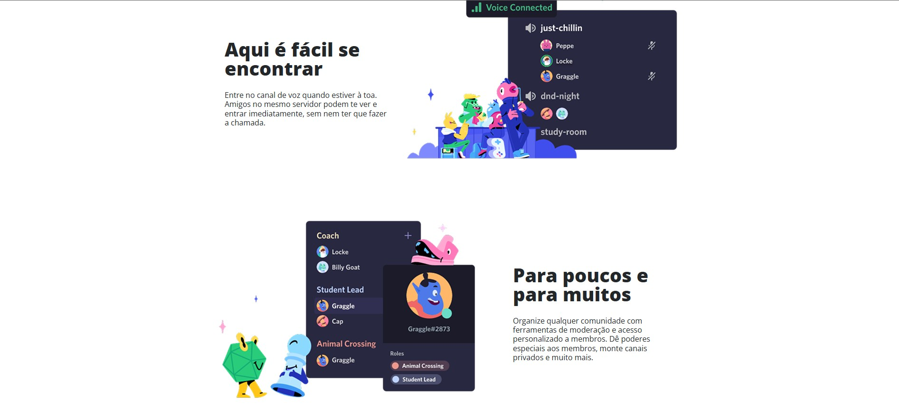
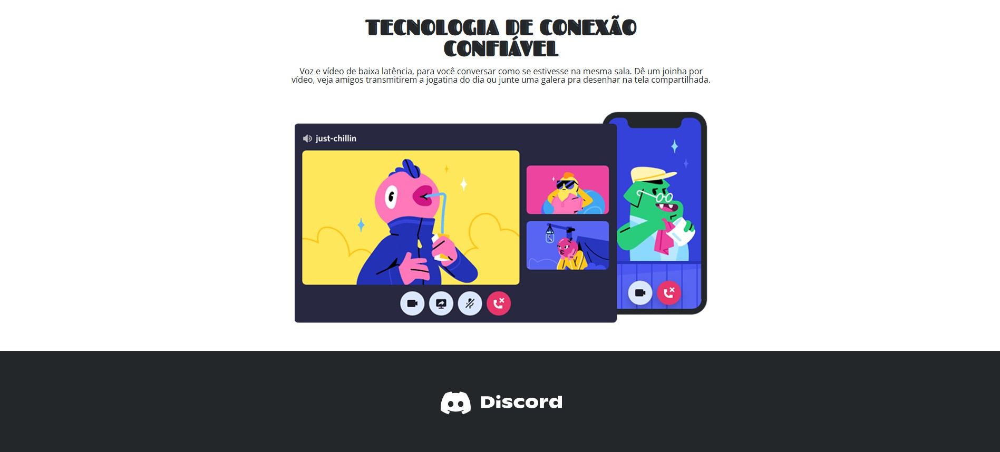
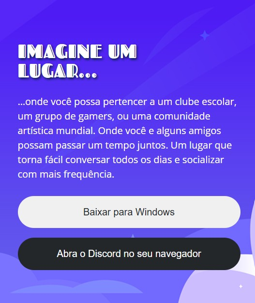
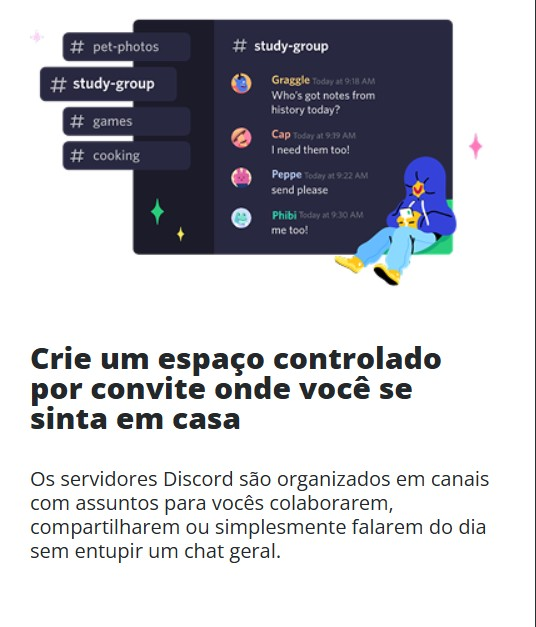
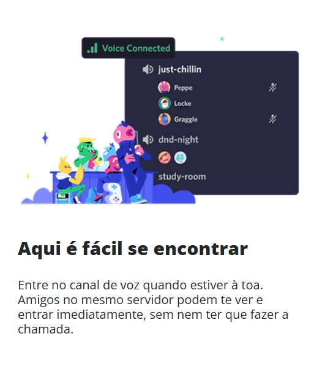
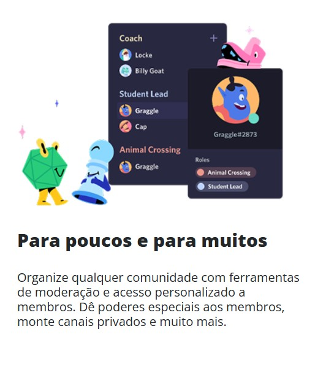
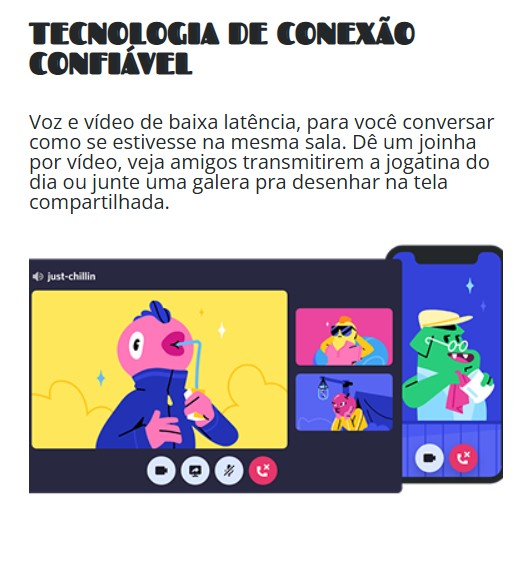

# 🚀 Desafio 03: Criando uma Landing Page da pagina do Discord 

Este projeto faz parte da **Trilha de CSS** promovida pela [DIO (Digital Innovation One)](https://www.dio.me/), durante o bootcamp **Front-End**, com parceria do **Santander**.

## 🎯 Desafio

O objetivo foi construir uma landing page estilizada para o site Discord, utilizando **HTML** e **CSS** puro. Este desafio foi pensado para reforçar os conceitos aprendidos ao longo da trilha, com foco especial no uso de **Flexbox**, **Grid Layout** e **Responsividade** .

## Resultado do projeto para desktop

## Resultado do projeto para mobile

## 📌 O que foi utilizado

- **HTML5**: Estrutura semântica da página;
- **CSS3**: Estilização completa com:
  - Flexbox;
  - Grid
  - Unidades relativas e absolutas (%, `rem`, `vh`, `px`);
  - Cores e fontes inspiradas na identidade visual do Discord;
- **Figma**: Para referência de layout e espaçamento.  
  👉 [Clique aqui para acessar o projeto no Figma](https://www.figma.com/design/NRBYrG5d4DSzObv7dpTqoM/Desafio-Responsividade---DIO?node-id=0-1&p=f&t=XCZP2sSp9EkXHS6f-0)

## 📱 Próximos passos

- [ ] Adicionar interações com **JavaScript** (futuramente).

##
> by Abgail Diniz
