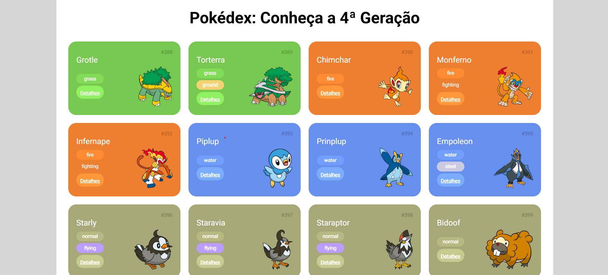

# 🚀 Desafio 01: Usando API

Este projeto faz parte da **Trilha de CSS** promovida pela [DIO (Digital Innovation One)](https://www.dio.me/), durante o bootcamp **Front-End**, com parceria do **Santander**.

## 🎯 Desafio

# 📖 Pokédex 

Este projeto consiste em uma **Pokédex**, desenvolvida com **HTML**, **CSS** e **JavaScript**.  
O objetivo foi reforçar os conceitos aprendidos ao longo da trilha, com foco na utilização da **PokéAPI** para obter os dados dos Pokémon.  

O usuário pode visualizar diferentes Pokémon e carregar mais opções conforme desejar, garantindo uma **interface organizada, responsiva e intuitiva**.  

---

## 🚀 Tecnologias Utilizadas
- **HTML5**  
- **CSS3**  
- **JavaScript**  
- **PokéAPI**  

---

## 🎯 Funcionalidades
- Exibe Pokémon da **4ª geração**.  
- Mostra informações básicas como **nome, número e tipo(s)**.  
- Botão para **carregar mais Pokémon** sob demanda.  
- Layout desenvolvido com **Flexbox** e **Grid Layout**.  
- Interface **responsiva** para diferentes tamanhos de tela.  

---

## Resultado do projeto 

## 📱 Próximos passos

- [ ] Adicionar página de detalhes para cada pokemon (futuramente).

##
> by Abgail Diniz